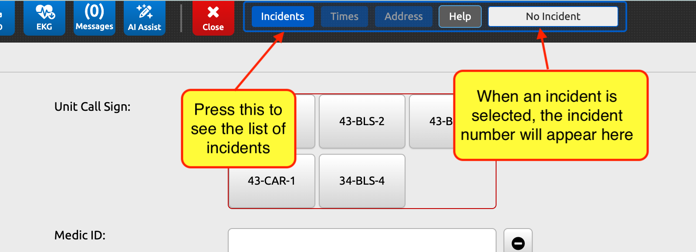
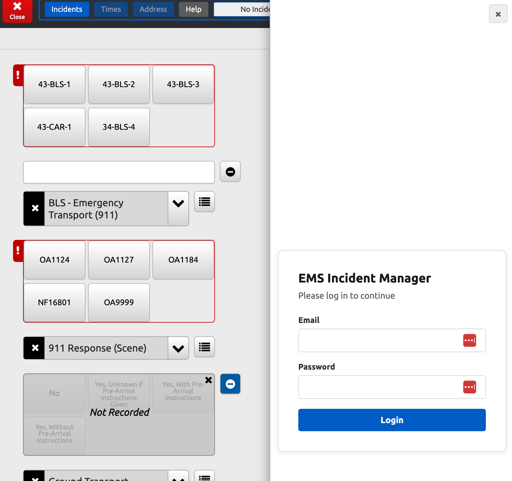
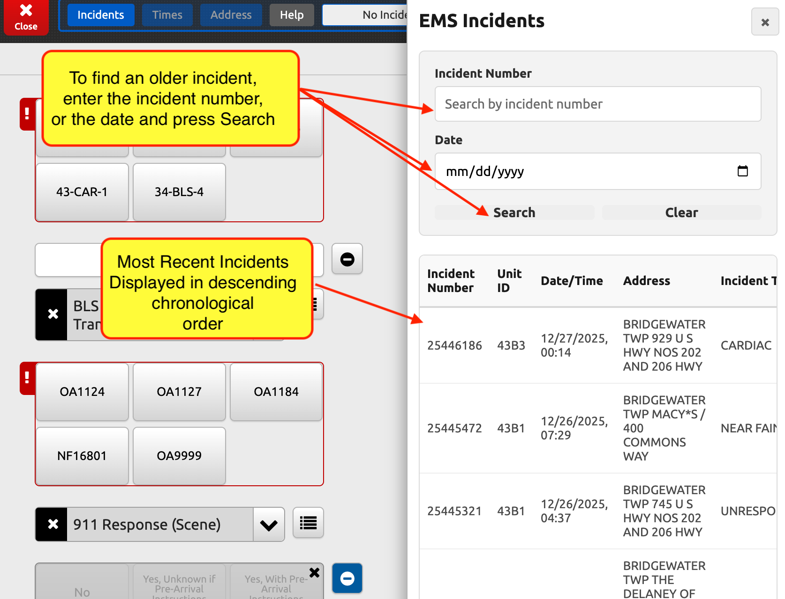
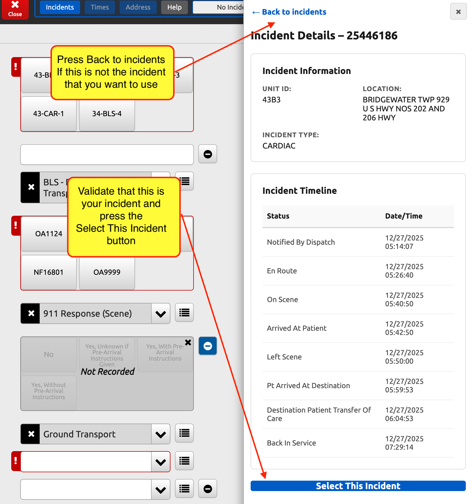
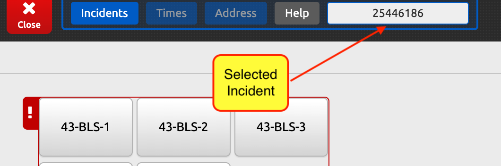
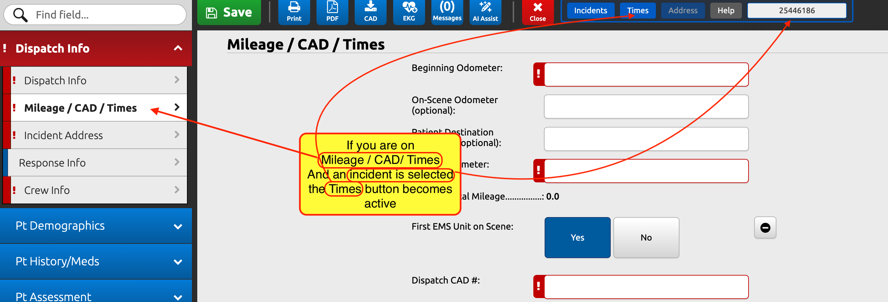
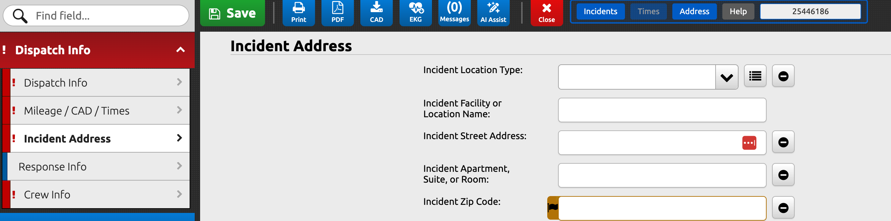

# PCR Toolbar User Guide

The PCR Toolbar appears at the top of the screen on the New Incident page.

## Toolbar Buttons

- **Incidents**: Opens the incident drawer to search and select incidents
- **Times**: Populates call times (only active on the Mileage/CAD/Times page with valid incident data)
- **Address**: Populates address fields (only active on the Incident Address page with valid incident data)
- **Help**: Opens this user guide in a new tab
- **Incident Display**: Shows the currently selected incident number (read-only)

## Logging In

When you first click the **Incidents** button, you'll need to log in to the incident manager (see the Administrator for userId/password). The login screen appears directly in the incident drawer - no popup will appear.

**Note**: If your session expires while using the tool, the login screen will appear in the drawer the next time you open it. You will not see any popup alerts.

## Selecting an Incident

In its initial state, there is no incident information loaded, so the right portion of the toolbar will read "No Incident". When you press the **Incidents** button, the incident drawer slides out from the right side of the screen.

### Searching for Incidents

When the incident drawer opens, it will by default show the latest incidents in reverse chronological order, with the most recent incident first. You can search for incidents using:

- **Incident Number**: Enter a specific incident number to find that incident
- **Date**: Select a date to see all incidents from that day

**Note**: These search filters are mutually exclusive - entering a value in one field will automatically clear the other. Use the **Clear** button to reset filters and show all recent incidents.

### Viewing Incident Details

If you see your incident in the list, click on it to view the incident detail page:

If this is the incident that you are working on, press the "Select" button at the bottom, otherwise, press the "Back to incidents" link at the top of the page to go back to the list.

Once you select an incident, the drawer will close and the incident number will appear in the toolbar's incident display field:

## Populating Data from Incidents

Once you have selected an incident, you can use the toolbar buttons to automatically populate form fields. **Important**: The toolbar buttons only become active when BOTH of these conditions are met:

1. You are on the correct page for that button
2. The selected incident contains the required data for that page

### Populating the Times Page

Navigate to the **Mileage / CAD / Times** page. If you have selected an incident that contains time data, the **Times** button will become active (no longer grayed out).

Click the **Times** button to automatically populate all the call times from the incident data.

**Note**: If the Times button remains grayed out even though you're on the correct page, the selected incident may not contain time data (incidentTimes). You may need to select a different incident.

### Populating the Address Page

Navigate to the **Incident Address** page. If you have selected an incident that contains location data, the **Address** button will become active.

Click the **Address** button to automatically populate the address fields from the incident data. The system will also automatically click the "Postal Code Lookup" button to populate city and state information.

**Note**: If the Address button remains grayed out, the selected incident may not contain location data (incidentLocation). You may need to select a different incident.

## Troubleshooting

### Buttons Won't Activate

If the Times or Address buttons remain grayed out:
1. Verify you've selected an incident (incident number should show in the toolbar)
2. Verify you're on the correct page (check the page header)
3. The incident may not contain the required data - try selecting a different incident
4. Reload the page and select the incident again

### Session Expired

If your session expires:
1. Click the **Incidents** button
2. The login screen will appear in the drawer
3. Log in again - your work on the form is not affected

### Need Help

Click the **Help** button on the toolbar to open this guide in a new tab, or contact your administrator for assistance.
